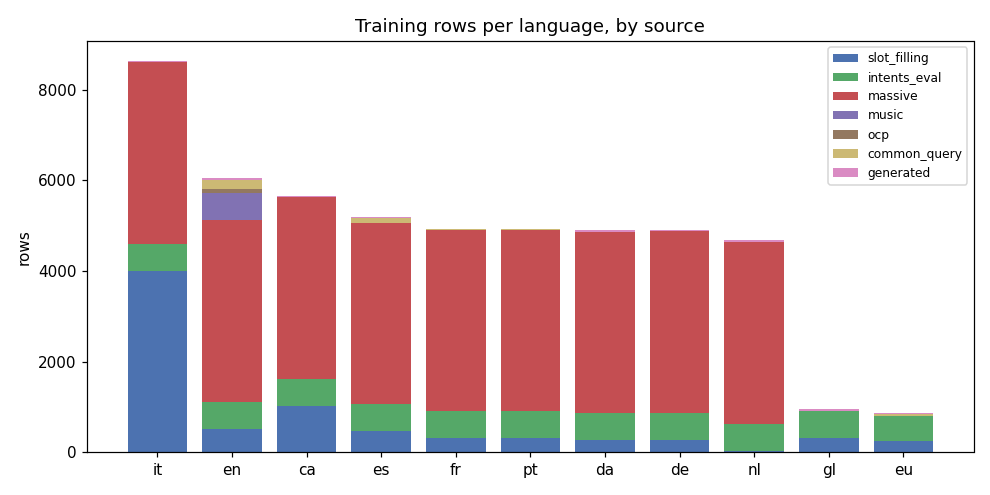
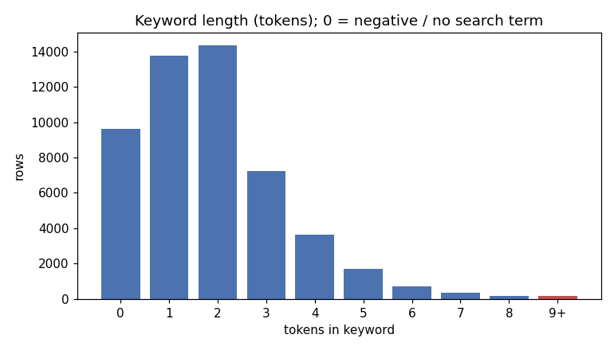
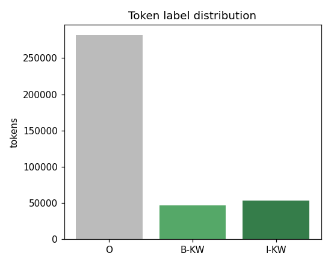
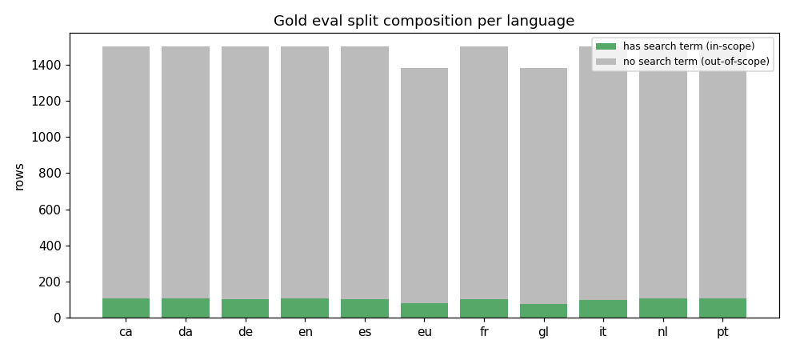

# Training dataset

`train/build_dataset.py` builds a multilingual, token-level **search-term
extraction** dataset: for each utterance, every token carries a `B-KW` / `I-KW`
/ `O` label marking the span a user would send to a common-query, DuckDuckGo, or
music skill. This is what the CRF learns to predict.

## Schema

One JSON object per line in `train/data/<lang>.jsonl`:

| field | type | meaning |
| --- | --- | --- |
| `lang` | str | language code (`ca da de en es eu fr gl it nl pt`) |
| `text` | str | the utterance (whitespace-joined tokens) |
| `tokens` | list[str] | tokens from the `quebra_frases` tokenizer |
| `labels` | list[str] | `B-KW` / `I-KW` / `O`, one per token |
| `source` | str | `slot_filling` \| `intents_eval` \| `massive` \| `music` \| `common_query` \| `generated` |
| `keyword` | str | the gold search term (the labelled span) |

The same `quebra_frases` tokenizer is used by the model at inference, so the
`tokens`/`labels` alignment carries over exactly. There is no POS field — the CRF
uses orthographic features only.

`train/data/stats.json` holds row counts per language and source.

## Sources

All sources feed one span-labelling routine that locates the keyword **by token
position**: tokenise the utterance, tokenise the value, match the subsequence,
and tag those tokens `B-KW`/`I-KW`. Matching whole token spans (not individual
words) keeps multi-word and possessive terms intact.

- **`slot_filling`** — OVOS locale `{query}` templates exported by
  [ovos-localize](https://github.com/OpenVoiceOS/ovos-localize) (common-query and
  DDG-solver skills). The `{query}` slot *is* the search term. `(a|b)`
  alternations are expanded with
  [ovos-spec-tools](https://github.com/OpenVoiceOS/ovos-spec-tools) `expand()`,
  the slot is filled with a real entity, and the inserted span is labelled.
  Templates carrying other (constrained) slots are skipped so no unfilled
  placeholder is ever labelled.
- **`music`** — [OpenVoiceOS/music_queries_templates](https://huggingface.co/datasets/OpenVoiceOS/music_queries_templates):
  `{artist_name}` / `{album_name}` / `{track_name}` slot templates filled with
  real music entities and span-labelled the same way.
- **`ocp`** — [OpenVoiceOS/OCP_templates](https://huggingface.co/datasets/OpenVoiceOS/OCP_templates):
  OVOS Common Play media query templates (`{movie_name}`, `{director_name}`,
  `{album_name}`, …). Slots carry no inline examples, so they are filled from the
  typed entity pool below; adult-labelled templates are dropped.
- **`intents_eval`** — [OpenVoiceOS/intents-for-eval](https://huggingface.co/datasets/OpenVoiceOS/intents-for-eval)
  `<locale>-templates`: `{slot}` templates carrying **in-language slot
  examples**. Every slot is filled from its examples (so sentences are fully
  realised); only *content/entity* slots (`song`, `artist`, `place_name`,
  `query`, … — see `CONTENT_SLOTS`) are labelled KW. Constrained slots (time,
  date, number, volume) are filled but left `O`.
- **`massive`** — [OpenVoiceOS/massive-templates](https://huggingface.co/datasets/OpenVoiceOS/massive-templates):
  the MASSIVE corpus in the same template+examples shape across 50+ locales,
  labelled identically. Templates with no content slot become bounded all-`O`
  **negatives** that teach the model when *not* to extract.
- **`common_query`** — [OpenVoiceOS/ovos-common-query-intents](https://huggingface.co/datasets/OpenVoiceOS/ovos-common-query-intents):
  real, natural questions with no markup. The local Gemma server labels the
  search-term span (verbatim substring, validated); these terms are recycled as
  native fill values for `slot_filling`, so the synthetic utterances use
  language-appropriate entities.
- **`generated`** — the local Gemma server invents extra natural search questions
  per language (with their search term), validated as a verbatim substring. A
  small synthetic top-up, most useful for the thin languages.

## Languages

The 11 languages with data and a `quebra_frases`-tokenised pipeline:
`ca da de en es eu fr gl it nl pt`.

## Why no POS tagger

An ablation (`brill` POS features vs none vs cheap orthographic features) found POS
tags add no measurable accuracy: prefix/suffix/word-shape/casing features match or
beat them. The model therefore uses orthographic features only and tokenises with
`quebra_frases`, dropping the `brill_postaggers` and `nltk` dependencies.

## Gold evaluation split

`train/data/gold/<lang>.jsonl` is the curated `<locale>-test` split of
intents-for-eval (filled utterance + `expected_slots`); the gold search term is
the content-slot value(s) in utterance order. This is the independent benchmark
`train/train_from_dataset.py` scores against — not a hold-out of the training
data.

## Entity pool

Content slots are filled with **real typed entities** from
[Jarbas/WikidataMediaEntities](https://huggingface.co/datasets/Jarbas/WikidataMediaEntities)
— 1.6M SFW entities across 53 types (`artist_name`, `album_name`, `movie_name`,
`book_name`, `game_name`, people, …) mapped to slot names, plus a blend of them
into the free `{query}` pool. The `{query}`/keyword pool also seeds from
`train/keywords_<lang>.txt` and grows with the Gemma-extracted `common_query`
spans. Multi-word entities are kept whole so the model learns full spans
(e.g. *speed of light*, not *speed*).

## Building

```bash
python train/build_dataset.py                 # all langs, all common-query
python train/build_dataset.py --langs en,pt   # subset
python train/build_dataset.py --no-gemma      # deterministic sources only (offline)
```

`slot_filling` and `music` are offline (seed pools ship in `train/`). The
`common_query` source needs the local Gemma server (`LLM_ENDPOINT` /
`LLM_MODEL`); `--no-gemma` skips it. The HF datasets download once into the
shared cache.

## Counts

51,587 training rows over 11 languages + a ~16,000-row gold split (see
`train/data/stats.json`). By source: massive 36,001, slot_filling 7,774,
intents_eval 6,406, music 602, common_query 420, generated 282, ocp 102.
`massive` and `slot_filling` are capped at 4,000/lang; eu and gl are thinner (no
MASSIVE coverage). `train/plots.py` regenerates the figures below.









## Evaluation

`train/train_from_dataset.py` fits a CRF per language and scores it on the **gold
split** (`train/data/gold/`, the `-test` configs of intents-for-eval + MASSIVE).
The score that matters is over the **in-scope subset** — gold rows that contain a
search term (exact whole-keyword match / token F1) — plus the negative-rejection
rate (`""` returned) on the out-of-scope rest:

| lang | in-scope n | exact | F1 | neg-reject |
| --- | --- | --- | --- | --- |
| ca | 110 | 0.81 | 0.91 | 0.88 |
| da | 107 | 0.82 | 0.93 | 0.90 |
| de | 102 | 0.76 | 0.90 | 0.88 |
| en | 109 | 0.77 | 0.90 | 0.86 |
| es | 104 | 0.76 | 0.91 | 0.85 |
| eu | 82  | 0.48 | 0.71 | 0.99 |
| fr | 103 | 0.81 | 0.92 | 0.89 |
| gl | 76  | 0.83 | 0.95 | 0.97 |
| it | 101 | 0.76 | 0.89 | 0.83 |
| nl | 108 | 0.82 | 0.93 | 0.89 |
| pt | 107 | 0.79 | 0.90 | 0.89 |

In-scope F1 sits near 0.90 and the model rejects ~89% of no-search-term
utterances (returning `""`) — it has no forced fallback. `eu` is the weak spot
(thin data, no MASSIVE coverage). Re-running the trainer writes candidate models
to `train/out/` for review before they replace `crf_query_xtract/kx_*.pkl`.

## Publishing

The combined `train/data/*.jsonl` is a self-contained, HF-publishable
token-classification dataset (BIO search-term tagging). The `common_query` rows
are LLM silver labels and should be spot-checked before being treated as gold.
